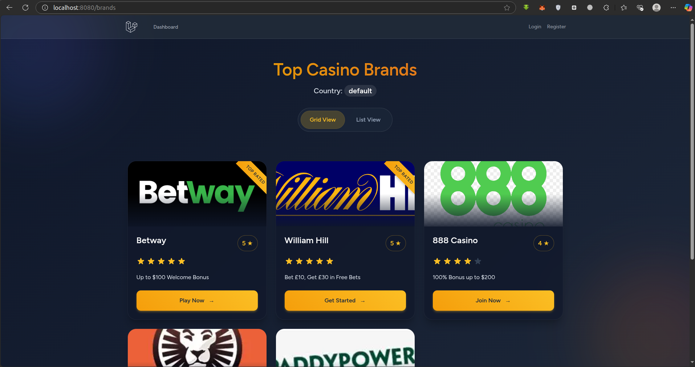
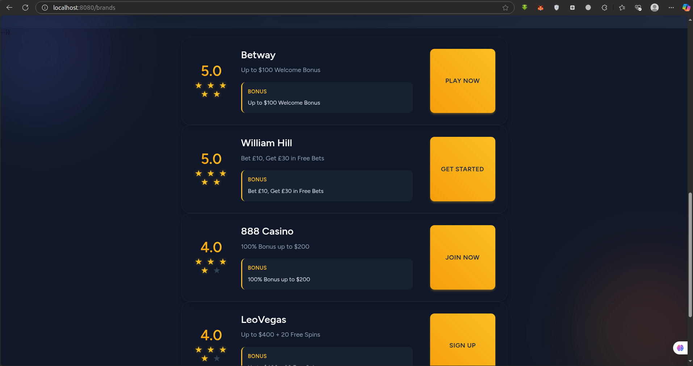

```markdown
# Casino Brands Manager - Technical Test

## Overview
This Laravel application showcases casino brands with a responsive web interface and REST API. Built for the BlueWindow PHP Fullstack Developer position, it demonstrates full-stack capabilities with Docker support.

## PLEASE I USE LINUX FOR THE DEVELOPEMNT PROCESS SO IT MIGHT BE DIFFRENT IS YOUR USING WINDOWS ESPECIALLY HWHERE I USE SUDO, FOR SUPER USER IT MIGHT BE DOFFRENT ON WINDOSW
## Features
- **Web Interface**
  - Grid/List view toggle
  - Mobile-responsive design
- **API Endpoints**
  - RESTful JSON responses
  - Geolocation support
- **Infrastructure**
  - Docker-compose setup(YOU SHOULD HAVE OR ALREADY INSALLED DOCKER FOR DESKTOP NO MATTER YOUR OPERATING SYSTEM)
  - MySQL database
  - Redis caching (optional)

## App Preview

lOOK AND FEEL OF THE APP:
[](screenshots/1.png)

[](screenshots/2.png)


## Installation
1. Clone repository:
```bash
git clone https://github.com/Ngwangshalom/topBrands.git
cd topBrands
```

2. Initialize environment:
```bash
cp .env.example .env
docker-compose up -d --build
```

3. Setup application:
```bash
docker-compose exec app composer install
docker-compose exec app php artisan key:generate
docker-compose exec app php artisan migrate --seed
docker-compose exec node npm install
docker-compose exec node npm run dev
```

Access the application at: `http://localhost:8080/brands`

## API Documentation
### Base URL: `http://localhost:8080/api`

### Endpoints:
| Endpoint | Method | Description |
|----------|--------|-------------|
| `/brands` | GET | List all brands |
| `/brands?min_rating=N` | GET | Filter by minimum rating |
| `/brands/{id}` | GET | Get specific brand |

### Example Request:
```bash
curl -X GET "http://localhost:8080/api/brands?min_rating=4" \
-H "CF-IPCountry: US" \
-H "Accept: application/json"
```

### Response Format:
```json
{
    "data": [
        {
            "id": 1,
            "name": "Brand Name",
            "rating": 4.5,
            "bonus": "Welcome bonus",
        }
    ]
}
```

## Development Commands
| Command | Description |
|---------|-------------|
| `docker-compose up -d` | Start containers |
| `docker-compose down` | Stop containers |
| `docker-compose exec app php artisan test` | Run tests |
| `docker-compose exec node npm run dev` | Frontend development |
| `docker-compose exec node npm run build` | Production assets |

## Troubleshooting
**Permission Issues:**
```bash
sudo chown -R $USER:$USER .
sudo chmod -R 775 storage bootstrap/cache
```

**Port Conflicts:**
```bash
docker-compose down
sudo lsof -i :8080
sudo kill -9 <PID>
```

## Technical Details
- **Backend**: Laravel 12, PHP 8.2
- **Frontend**: Vanilla JS, HTML, Blade, CSS
- **Database**: MySQL 8
- **Cache**: Redis
- **Web Server**: Nginx
