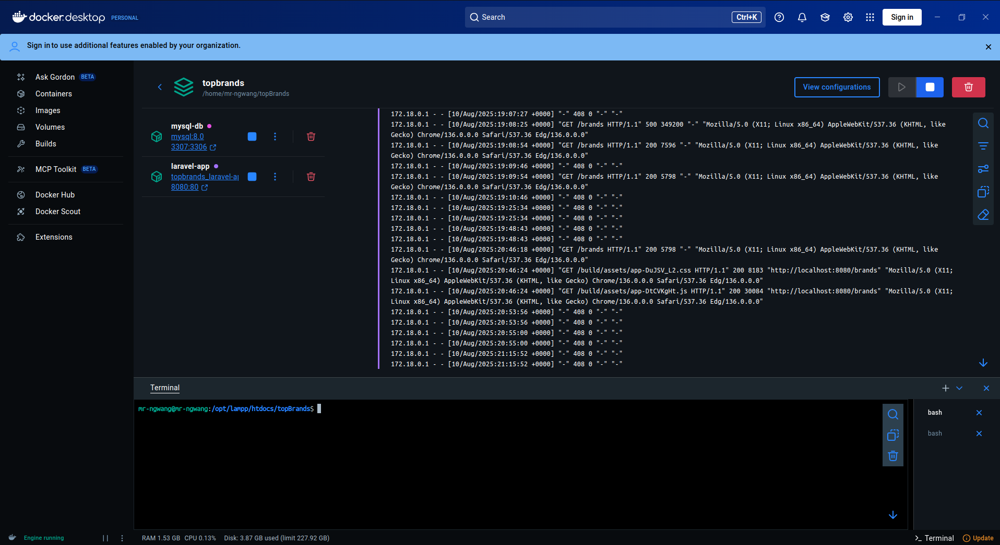

# Casino Brands Manager - Technical Test

## Overview
This Laravel application showcases casino brands with a responsive web interface and REST API.  
Built for the BlueWindow PHP Fullstack Developer position, it demonstrates full-stack capabilities with Docker support.

> **Note:** This project was developed on Linux. If you are using Windows, some commands using `sudo` might differ.

## Features
- **Web Interface**
  - Grid/List view toggle
  - Mobile-responsive design
- **API Endpoints**
  - RESTful JSON responses
  - Geolocation support (via `CF-IPCountry` header)
- **Infrastructure**
  - Docker Compose setup (requires Docker installed)
  - MySQL database
  - Redis caching (optional)

## App Preview

### Look and Feel of the App:


  


---

## Installation

1. **Clone repository:**

```bash
git clone https://github.com/Ngwangshalom/topBrands.git
cd topBrands
```

2. **Initialize environment and start containers:**

```bash
cp .env.example .env
docker-compose up -d --build
```

3. **Set up the application:**

```bash
docker-compose exec app composer install
docker-compose exec app php artisan key:generate
docker-compose exec app php artisan migrate --seed
docker-compose exec node npm install
docker-compose exec node npm run dev
```

4. **Access the app:**

Open your browser and visit:  
`http://localhost:8080/brands`

---

## API Documentation

**Base URL:** `http://localhost:8080/api`

| Endpoint              | Method | Description              |
|-----------------------|--------|--------------------------|
| `/brands`             | GET    | List all brands          |
| `/brands?min_rating=N`| GET    | Filter brands by minimum rating |
| `/brands/{id}`        | GET    | Get specific brand info  |

### Example Request

```bash
curl -X GET "http://localhost:8080/api/brands?min_rating=4"      -H "CF-IPCountry: US"      -H "Accept: application/json"
```

### Example Response

```json
{
  "data": [
    {
      "id": 1,
      "name": "Brand Name",
      "rating": 4.5,
      "bonus": "Welcome bonus"
    }
  ]
}
```

---

## Development Commands

| Command                                    | Description             |
|--------------------------------------------|------------------------|
| `docker-compose up -d`                      | Start containers       |
| `docker-compose down`                       | Stop containers        |
| `docker-compose exec app php artisan test` | Run backend tests      |
| `docker-compose exec node npm run dev`     | Start frontend dev server |
| `docker-compose exec node npm run build`   | Build frontend for production |

---

## Troubleshooting

### Permission Issues

```bash
sudo chown -R $USER:$USER .
sudo chmod -R 775 storage bootstrap/cache
```

### Port Conflicts on 8080

```bash
docker-compose down
sudo lsof -i :8080
sudo kill -9 <PID>
```

---

## Technical Details

- **Backend:** Laravel 12, PHP 8.2  
- **Frontend:** Vanilla JS, Blade templates, CSS  
- **Database:** MySQL 8  
- **Cache:** Redis (optional)  
- **Web Server:** Nginx (in Docker container)  

---

Thank you for reviewing my technical test!  
Feel free to reach out if you have any questions.
